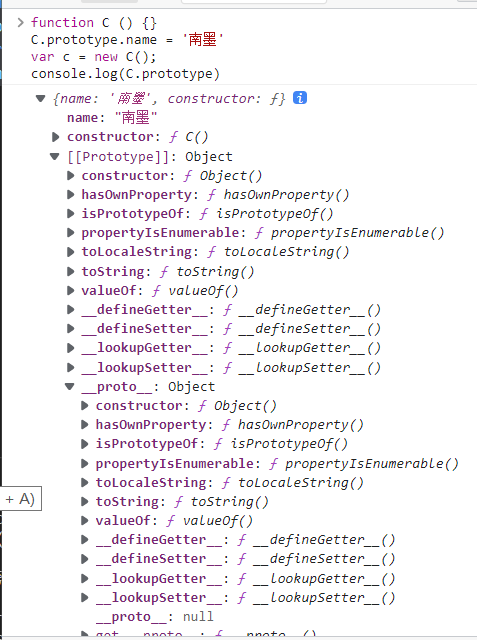

# 原型以及原型链

## 构造函数

什么是构造函数？

举个例子：

```js
function C() {}
var c = new C()
```

例子中的 C 就是就是构造函数。

## prototype

**JavaScript 函数中都会有个 prototype 属性**，这个属性我们来看一下是什么：

```js
function C() {}
C.prototype.name = '南墨'
console.log(C.prototype)
// { name: "南墨",
//   constructor: ƒ C()
//   [[Prototype]]: Object
// }
var c1 = new C()
var c2 = new C()
console.log(c1.name) // 南墨
console.log(c2.name) // 南墨
```

通过以上代码，可以看到上面例子中，prototype 属性输出了一个对象，**prototype 是实例的原型**即上面例子的 c1 和 c2 的原型。

原型的定义：

当创建一个新对象时都会有另一个对象与其关联（如上例中 c1 与 C.prototype 的关系），并且新对象会继承另一个对象的属性（如上例中，c1.name 就是继承了 C.prototype.name），这个新对象就是所谓的实例，与之关联的另一个对象就是原型。

那么实例如何指向原型呢？即 c1 如何指向 C.prototype。接下来介绍这个属性**proto**

## **proto**

每一个对象都有一个**proto**属性，**proto**指向对象的原型。

可以通过如下代码观察：

```js
function C() {}
C.prototype.name = '南墨'
var c = new C()
console.log(c.__proto__)
// { name: "南墨",
//   constructor: ƒ C()
//   [[Prototype]]: Object
// }
```

可以看出 C.prototype 和 c.**proto**都指向同一个对象。

我们可以看到 prototype 中有一个[[Prototype]]属性，这是什么呢？

## [[Prototype]]

[[Prototype]]是对象的内部私有属性，和**proto**是一样的，都是指向对象的原型。**proto**是浏览器可直接访问的，[[Prototype]]不能。

可以输出一下看看：

```js
function C() {}
C.prototype.name = '南墨'
var c = new C()
console.log(C.prototype)
```


可以看出来[[Prototype]]中有**proto**, 而**proto**和[[Prototype]]几乎一样都指向 Object 原型，[[Prototype]]只是多了一个**proto**。
**proto**里层的**proto**是 null，这里会形成一个链条。

```js
c.__proto__.__proto__.__proto__ === null。// 这其实就是原型链
```

原型链定义：JavaScript 实例对象通过 **proto** 指向原型，原型中也有 **proto** 可以继续指向上一级原型，直到指向 Oject 原型中的**proto**，Object.**proto**指向 null，这样就形成了一个原型指向的链条, 即原型链。

## constructor

原型中还有一个 constructor，直接来看看是什么。

```js
function C() {}
C.prototype.name = '南墨'
var c = new C()
console.log(C.prototype.constructor)
// ƒ C () {}
```

可以看出来 constructor 对象指向 f C () {}，即构造函数。
