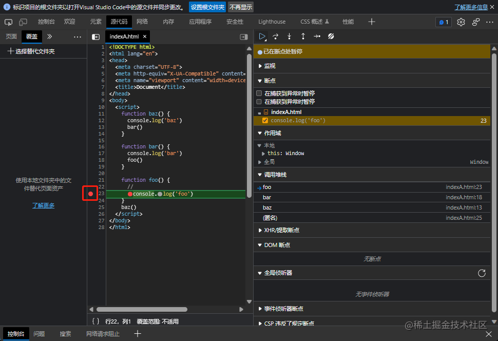
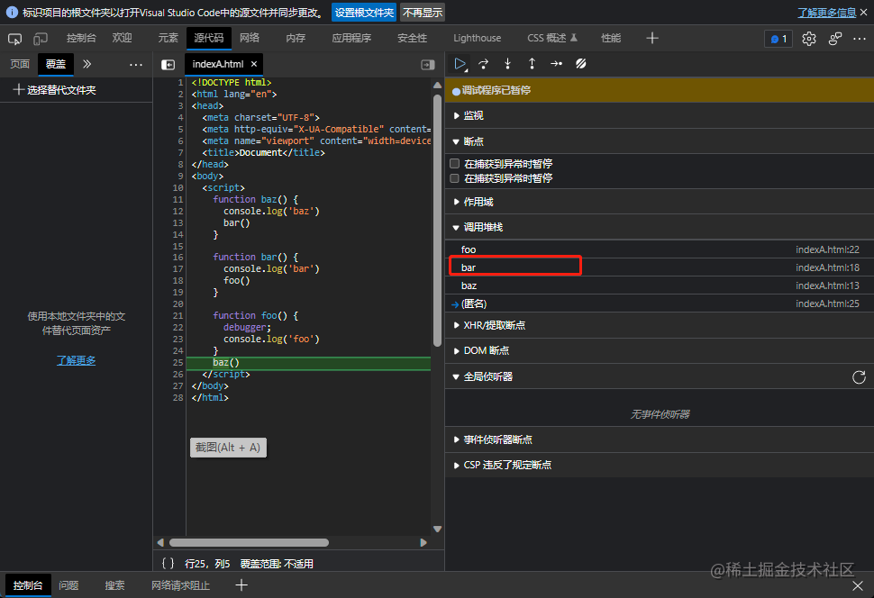

# 前言

`JavaScript` 中的 `this` 是一个非常重要的概念，也是一个令新手开发者甚至有些不深入理解的多年经验开发者都会感到困惑的概念。

如果你希望自己能够使用 `this` 编写更好的代码或者更好理解他人的代码，那就跟着我一起理解一下`this`吧。

# 要理解 this 的原因

我们先搞清楚为什么要理解 `this` 的，再去学习它。

- 学习 `this` 可以帮助我们更好地理解代码的上下文和执行环境，从而编写更好的代码。

**例 1**：

```js
function speakfullName() {
  console.log(this.firstname + this.lastname)
}

var firstname = '南'
var lastname = '墨'

const gril = {
  firstname: '李',
  lastname: '梅',
  speakfullName
}

const boy = {
  firstname: '王',
  lastname: '明',
  speakfullName
}

gril.speakfullName() // 输出： 李梅
boy.speakfullName() // 输出： 王明
speakfullName() // 输出： 南墨
```

在这个例子中，如果你没理解 `this` 的用法，那么阅读这段代码就会觉得奇怪，为什么同一个函数会输出不同的结果。之所以奇怪，是因为你不知道他的上下文到底是什么。

- 学习 `this` 可以帮助我们编写更具可重用性和可维护性的代码

在例 1 中可以在不同的上下文中使用 `this`，不用针对不同版本写不同的函数。当然不使用 `this`，也是可以的。

**例 2**：

```js
function speakfullName(person) {
  console.log(person.firstname + person.lastname)
}

const gril = {
  firstname: '李',
  lastname: '梅'
}

const boy = {
  firstname: '王',
  lastname: '明'
}

speakfullName(gril) // 李梅
speakfullName(boy) // 王明
```

虽然目前这段代码没有问题，如果后续使用的模式越来越复杂，那么这样的显示传递会让代码变得难以维护和重用，而 this 的隐式传递会显得更加优雅一些。因此，学习`this`可以帮助我们编写更具有可重用性和可维护性的代码。

接下来我们开始正式全面解析 `this`

# 解析 this

我相信大家多多少少都理解一些 `this` 的用法，但可能不够全面，所以接下来我们就全面性的理解 `this`。

很多人可能认为`this` 写在哪里就是指向所在位置本身，如下代码：

```js
var a = 2
function foo() {
  var a = 1
  console.log(this.a)
}
foo()
```

有些人认为会输出`1`，实际是输出`2`，这就是不够理解 `this` 所产生的的误会。

那`this`的机制到底是什么样的呢？

其实`this`不是写在哪里就被绑定在哪里，而是代码运行的时候才被绑定的。也就是说如果一个函数中存在`this`，那么`this`到底被绑定成什么取决于这个函数以什么样的方式被调用。

既然已经提出了这样一个机制，那我们该如何根据这个机制，去理解和判断`this`被绑定成什么呢？

下面我们继续介绍这个机制的基本原理。

## 调用位置

上面说过，函数的调用位置会影响`this`被绑定成什么了，所以我们需要知道函数在哪里被调用了。

我们回头去看一下 **例 1**，来理解什么是调用位置：

```js
// ...
gril.speakfullName() // 输出： 李梅
boy.speakfullName() // 输出： 王明
speakfullName() // 输出： 南墨
```

同一个函数 `speakfullName`， 在不同的调用位置，它的输出就不一样。

在 `gril` 对象中调用时，输出了`李梅`，在 `boy` 对象中调用时，输出了`王明`，在全局调用时输出了`南墨`。

当然例子中的调用位置是非常容易看出来的。所以我们接下来继续讲解在套多层的情况下如何找到调用位置。

我们要找到调用位置就要分析调用栈。

看下简单例子：

```js
function baz() {
  // 当前调用栈：baz
  console.log('baz')
  bar() // bar 调用的位置
}

function bar() {
  // 当前调用栈：baz-bar
  console.log('bar')
  foo() // foo 调用的位置
}

function foo() {
  // 当前调用栈：baz-bar-foo
  console.log('foo')
}
baz() // baz的调用位置
```

其实调用栈就是调用位置的链条，就像上面代码例子中所分析的一样。不过在一些复杂点的代码中，这样去分析很容易出错。所以我们可以用现代浏览器的开发者工具帮助我们分析。

比如上例中，我们想找到 `foo` 的调用位置，在 `foo` 中第一行输入`debugger`。

```js
// ...

function foo() {
  debugger
  // ...
}
// ...
```

或者打开浏览器的开发者工具到源代码一栏找到，foo 的代码的第一行打一个断点也行，如下图：



接着在源代码一栏，找到调用堆栈的 foo 的下一个就是 bar，bar 就是 foo 的调用位置。



## 绑定规则

接下来看看调用位置如何决定 this 被绑定成什么，并且进行总结。

### 默认规则

第一种情况是函数最经常被调用的方式，函数被单独调用。看以下例子：

```js
var name = '王明'
function fn() {
  console.log('我是' + this.name)
}
fn() // 我是王明
```

运行`fn`后，最终输出了 `我是王明`。众所周知，上例中的 `name` 是全局的变量，这样说明了`fn`中的 `this.name` 被绑定成了全局变量`name`。因此，this 指向了全局对象。

因为在上例的代码片段中，`foo`的调用位置是在全局中调用的，没有其他任何修饰, 所以我们称之为**默认规则**。

使用了严格模式的话，上例代码会出现什么样的情况呢？

```js
var name = '王明'
function sayName() {
  'use strict'
  console.log(this) // (1)
  console.log('我是' + this.name) // (2)
}
fn()
// undefined
// TypeError: cannot read properties of undefined (reading 'name') as sayName
```

可以看出来(1)也就是 this，输出了 undefiend 所以(2)就直接报错了。

因此我们可以得出默认规则的结论：在非严格模式下，`this`默认绑定成全局对象，在严格模式下，`this` 被绑成 `undefined`。

### 隐式绑定

这条规则需要我们去判断函数的调用是否有上下文对象，也就是说函数调用的时候前面是否跟了一个对象，举个例子看下。

```js
function sayName() {
  console.log(`我是` + this.name)
}
var person = {
  name: '王明',
  sayName
}
person.sayName() // 我是王明
```

在这个例子中， `sayName` 前面有一个 `person`，也就是说 `sayName` 函数有一个上下文对象`person`， 这样调用 `sayName` 的时候，函数中 `this` 被绑定成了`person`，因此 `this.name` 和 `person.name` 是一样的。

在观察隐式绑定的时候，有两种值得我们注意的情况：

- 如果说一个函数是通过对象的方式调用时，只有最后一个对象起到上下文的作用。
  **例 3:**

```js
function sayName() {
  console.log(`我是` + this.name)
}

var child = {
  name: '王明',
  sayName
}

var father = {
  name: '王勇',
  child
}

father.child.sayName() // 我是王明
```

这个例子中，是通过一个对象链调了`sayName`，没有输出`我是王勇`，而是`我是王明`。因此 `this` 指向了`child` 对象，说明`this` 最终绑定为对象链的最后一个对象。

- 隐式丢失的情况就是被隐式绑定的函数丢失绑定的上下文，转而变成了应用默认绑定。

```js
function sayName() {
  console.log(`我是` + this.name)
}
var person = {
  name: '王明',
  sayName
}

var personSayName = person.sayName

var name = '南墨'

pesonSayName() // '我是南墨'
```

虽然 `personSayName` 看起来是由 `person.sayName` 赋值的来，拥有上下文对象`person`，但实际上 `personSayName` 被赋予的是 `sayName` 函数本身，因此此时的 `personSayName`其实是一个不带修饰的函数，
所以说会被认为是默认绑定。

### 显示绑定

隐式绑定是通过一个看起来不经意间的上下文的形式去绑定的。

那也当然也有通过一个明显的上下文强制绑定的，这就是显示绑定

在 `javaScript` 中，要是使用显示绑定，就要通过 `call` 和 `apply`方法去强制绑定上下文了

这两个方法的使用方法是什么样的呢？
`call` 和 `apply`的第一个参数的是一样的，就是传入一个我们想要给函数绑定的上下文。

来看一下下面的例子

```js
function sayName() {
  console.log(this.name)
}

var person = {
  name: '南墨'
}

sayName.call(person) // 南墨
```

看到没？ 我们通过 call 的方式，将函数的上下文绑定为了 `person`，因此打印出了 `南墨`。

使用了 `call` 绑定也会有绑定丢失的情况，所以我们需要一种保证在我意料之内的办法，
可以改造显示绑定，思考如下代码：

```js

function sayName() {
 console.log(this.name)
}

var person = {
 name: 南墨
}

function sayNanMo() {
 sayName.call(person);
}

sayNanMo() // 南墨
setTimeout(sayNanMo， 10000) // 南墨
sayNanMo.call(window) // 南墨
```

这样一来，不管怎么操作，都会输出南墨，是我想要的结果

我们将 sayName.call(person) 放在的 `sayNanMo` 中，因此`sayName` 只能被绑定为我们想要绑定的 `person`。

我们可以将其写成可复用的函数

```js
function bind(fn, obj) {
  return function () {
    fn.apply(obj, arguments)
  }
}
```

`ES5` 就提供了内置的方法 `Function.prototype.bind`，用法如下：

```js
function sayName() {
  console.log(this.name)
}

var person = {
  name: '南墨'
}

sayName.bind(person)
```

### new 绑定

`new` 绑定也可以影响函数调用时的 `this` 绑定行为，我们称之为`new` 绑定。

思考如下代码：

```js
function person(name) {
  this.name = name
  this.sayName = function () {
    console.log(this.name)
  }
}

var personOne = new person('南墨')

personOne.sayName() // 南墨
```

`personOne.sayName` 能够输出南墨，是因为使用 `new` 调用 `person` 时，会创建一个新的对象并将它绑定到 `person` 中的 `this` 上，所以`personOne.sayName`中的 `this.name` 等于外面的`this.name`。

### 规则之外

值得一提的是，ES6 的箭头函数，它的 this 无法使用以上四个规则，而是而是根据外层（函数或者全局）作用域来决定 this。

```js
function sayName() {
  return () => {
    console.log(this.name)
  }
}

var person1 = {
  name: '南墨'
}

var person2 = {
  name: '王明'
}
sayName.call(person1)
sayName.call(person1).call(person2) // 王明，如果是普通函数会输南墨
```

# 总结

要想判断一个运行的函数中 this 的绑定，首先要找到函数调用位置，因为它会影响 this 的绑定。然后使用四个绑定规则：new 绑定、显示绑定、隐式绑定、默认规则
来判断 this 的绑定。
