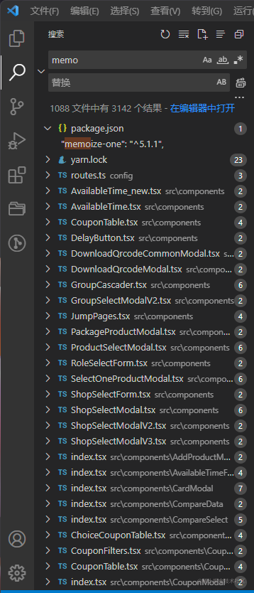

# 前言

本文适合对[React](https://react.docschina.org)以及[Hook](https://react.docschina.org/docs/hooks-intro.html)有一定的了解的人。

编写此文的目的是因为看到公司项目代码，随意地使用`useMemo`或者是`memo`。



我用关键字`memo`搜索公司其中一个项目，相关结果竟然达到了`3000+`个之多。

可能团队有些伙伴对这两个`API`的认知不够到位。所以我准备梳理一下分享给大家。

因为`useMemo`、`memo`、`useCallBack`是有一定关系的，都会用于优化组件重复渲染的问题，所以`useCallBack`顺带也一起讲解了。

# React.memo

如果你熟悉 [React.PureComponent](https://zh-hans.reactjs.org/docs/react-api.html#reactpurecomponent)，那么就很好理解[React.memo]()了。简单的来说两者共同点都对 `Props` 进行浅比较，区别是 `PureComponent` 用于 `class` 组件，而 `memo` 用于 `function` 组件。

> 特别说明本文的例子都不需要优化，只是帮助理解

来看个示例：

```js
function App() {
  const [num1, setNum1] = useState(0)
  const [num2] = useState(0)

  const handleAdd = () => {
    setNum1((pre) => pre + 1)
  }

  return (
    <>
      <button onClick={handleAdd}>add</button>
      <Num num={num1} name="组件1" />
      <Num num={num2} name="组件2" />
    </>
  )
}
```

```js
function Num({ num, name }) {
  console.log(`${name}: ${num}`)
  return (
    <div>
      {name}: {num}
    </div>
  )
}

export default Num
```

当用户点击按钮的时候，每次都会在控制台输出两个值。说明每次点击，两个`<Num/>`都会重新渲染。

假设`<Num/>`要是一个非常复杂的组件，达到每次重渲染都让页面感觉到卡顿了。那我们就需要想办法进行优化了。要怎么办呢？没错，就是用`React.memo`，只需要把`<Num/>`包在`React.memo`里面就好。 如下例：

```js
function Num({ num, name }) {
  console.log(`${name}: ${num}`)
  return (
    <div>
      {name}: {num}
    </div>
  )
}

export default React.memo(Num)
```

这时候再点击按钮，`组件2`就不再进行渲染。

上例中，`memo`比较了新旧`Props`（即我们从父组件传给`<Num/>`的`num`和`name`）判断是否需要进行重渲染，如果比较的结果是一样的，就会重用上次的渲染结果。因为我们点击按钮只改变`num1`，`num2`一直不变，因此`组件2`没有再次渲染。

接下来，我们现在希望上面的例子在子组件可以进行减法，例子如下：

```js
function App() {
  ....
  const handleSub1 = () => {
    setNum1(pre => pre - 1)
  }

  const handleSub2 = () => {
    setNum2(pre => pre - 1)
  }

  return (
    <>
      <button onClick={handleAdd}>add</button>
      <Num num={num1} handleSub={handleSub1} name='组件1' />
      <Num num={num2} handleSub={handleSub2} name='组件2' />
    </>
  )
}
```

```js
function Num({ num, name, handleSub }) {
  console.log(`${name}: ${num}`)
  return (
    <div>
      <div>
        {name}: {num}
      </div>
      <button onClick={handleSub}>-</button>
    </div>
  )
}

export default React.memo(Num)
```

这时候再去看下控制台，咦！怎么回事，memo 失效了。这时候我们点击按钮，`组件2`也一直在重渲染。

**这因为`memo`对父级传来的`Props`只是进行浅比较，而我们新加的`handleSub`是引用类型，父组件的 state 在变化一直在重渲染，handleSub 也一直在重建，所以子组件即使使用了 memo，也认为 Props 改变了。**

这时候我们需要一个方法来解决这个问题，那就要用`useCallBack`。当然，如果传给子组件的是对象或者数组，那么我们将使用`useMemo`，后面讲到`useMemo`再细说。

> 引自([Hook API – React](https://zh-hans.reactjs.org/docs/hooks-reference.html#usecallback))：当你把回调函数传递给经过优化的并使用引用相等性去避免非必要渲染（例如  shouldComponentUpdate）的子组件时，useCallBack 将非常有用。

# useCallBack

我们接着来看上面的例子，通过`useCallBack`进行优化，只需要将`handleSub1`和`handleSub2`用`useCallback`包裹起来。

```js
function App() {
  ....
  const handleSub1 = useCallback(() => {
    setNum1(pre => pre - 1)
  }, [])

  const handleSub2 = useCallback(() => {
    setNum2(pre => pre - 1)
  }, [])
  .....
}
```

因为`useCallback`包裹的函数依赖是空的所以它们就不会再重建了，这样传递给子组件的`props`就总是相同的`handleSub`了。

# useMemo

useMemo 有两个应用场景：

场景一：配合 memo 使用，保证父组件传递的引用类型`props`不重建，从而避免不必要的渲染。

还是借用上面的例子，如果给子组件传递数组时，不去保证数组不重建，那么会和之前一样，memo 失效，所以同理，我们现在给组件包裹一层`useMemo`：

```js
function App() {
  ....
  const arr = useMemo(() => { return [] },[])
  return (
    <>
      <button onClick={handleAdd}>add</button>
      <Num num={num1} handleSub={handleSub1} name='组件1' />
      <Num num={num2} handleSub={handleSub2} name='组件2' arr={arr} />
    </>
  )
}
```

```js
function Num({ num, name, handleSub }) {
  console.log(`${name}: ${num}`)
  return (
    <div>
      <div>
        {name}: {num}
      </div>
      <button onClick={handleSub}>-</button>
      {arr.map((item) => (
        <div>{item}</div>
      ))}
    </div>
  )
}

export default React.memo(Num)
```

场景二：通常，我们不想组件重新渲染时一次又一次地计算一个**计算昂贵的值**时，我们可以使用 `React.useMemo`。

```js
const Me = ({ girlFriendWords }) => {
  // 假设girlFriendWords是一个字符串

  const myReply = decideWhatToSay(girlFriendWords)

  return <p>{myReply}</p>
}
```

想象一下上面的代码场景：女朋友跟我说了一句话，此时我需要决定回复说什么，需要花费我的精力。

她跟说我了一句话，我也回复她了。她去忙她的事了，我也去忙别的，但是我的脑海里还一直重复决定回复同一句话。那我岂不是要被累死了。

所以这时候我就需要一个像`useMemo`这样的功能来帮我，当女朋友来找我说话的时候才决定回她什么：

```js
const Me = ({ girlFriendWords }) => {
  // 假设girlFriendWords是一个字符串

  const myReply = useMemo(() => decideWhatToSay(girlFriendWords), [girlFriendWords])

  return <p>{myReply}</p>
}
```

好了，这样我才能安心的去忙别的了。

在上例中，`() => decideWhatToSay (girlFriendWords)`函数，根据`useMemo`的第二个参数数组 girlFriendWords，来判断函数是否执行。这样就能保证避免高开销的计算重复计算。

# 随意使用 useMemo、useCallBack 的开销

最后来讨论一个重点问题，在开发过程中可以随意使用`useMemo`或者`useCallBack`吗？

引用一段 React 文档对这个问题的回答：**你可以把  `useMemo`  作为性能优化的手段，但不要把它当成语义上的保证**。

为什么？ 举个例子：

```js
const App = ({ num }) => {
  const result = num + 1
  return <p>result</p>
}
```

开发时突发奇想用了`useMemo`，代码变成这样：

```js
const App = ({ num }) => {
  const calculation = () => {
    return num + 1
  }

  const result = useMemo(calculation, [num])

  return <p>{result}</p>
}
```

这个例子只是进行一个简单的计算，可是加了这么多的代码。每一行多余代码的执行都产生消耗，哪怕这消耗只是 `CPU` 的一丁点热量。

而且使用 `useMemo` 后，每次执行到这里内部要比对值是否变化，还有存一下之前的函数，消耗更大了，所以使用`useMemo`来写该场景下的组件，我们并未获得任何收益（函数还是会被创建），`useMemo`用的越多，负重越多。

站在 Javascript 的角度，当组件刷新时，未被 useMemo 包裹的方法将被垃圾回收并重新定义，但被`useMemo`所制造的闭包将保持对回调函数和依赖项的引用。

# 总结

1. 我们应该先写没有优化的代码，优化总是有代价的。遇到需要优化时，再进行优化。
2. 在使用时`memo`，需要注意是否传了引用类型，如果用了要保证传给子组件的 props 是合理的，不做无用的优化。
