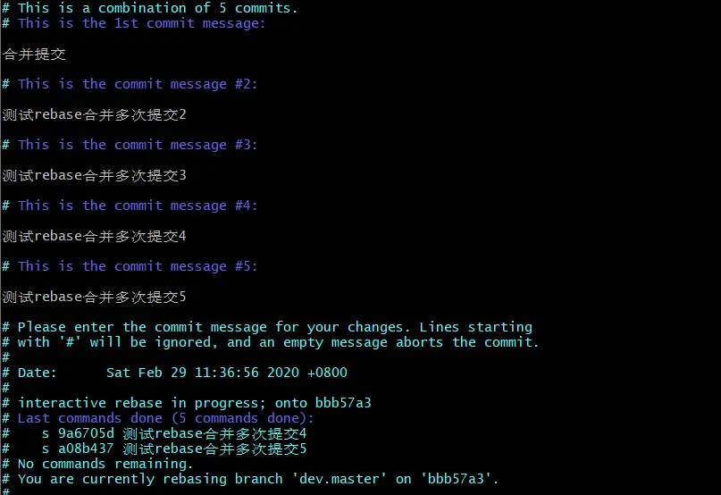

## git rebase

除了 git merge 外，git 还有另外一个合并分支的命令：git rebase。 rebase 实际上就是一个分支取出系列的提交记录，“复制” 它们，然后移到另一个分支上。

### 实战操作步骤

1. 创建一个 bugFix 分支，并切换到 bugFix 分支
2. 修改一些代码，提交一次、
3. 切换回 master 分支再提交一次
4. 再次切换到 bugFix 分支，rebase 到 master 上

### 思考

rebase 的实际操作其实和 merge 都是一样的，把 master 的内容合到开发分支。
区别在于，rebase 的记录是线性直接移接过来的没有产生新记录，的而 merge 是会创建一个新的记录。

## git commit --amend

已提交 commit 后，继续再这条 commit 推送代码

例如，我完成了某个功能，我提交了代码

突然我发现有一个错误，我进行修改，但是又不想多一个 commit，于是就可以使用：

```
git commit --amend
```

如果修改最新的一次提交，但你不想对 commit 提交信息进行修改可以用

```
git commit --amend --no-edit
```

## HEAD 移动

### 分离 HEAD

什么是分离 HEAD，正常情况下 HEAD 是指向分支的。要做到分离 HEAD，需要把 HEAD 指向一个特定的提交，这样 HEAD 就不再指向分支了。

### 作用

分离 HEAD 的作用是，在切换分支时，HEAD 不会跟着变，这样就不会在切换分支时丢失工作。

### HEAD^

可以通过 HEAD^ 将 HAEAD 指向的提交的前一个提交。

### HEAD~

HEAD~1 指向 HEAD 的父提交，HEAD~2 指向 HEAD 的父提交的父提交，以此类推。

### git branch -f

git branch -f <new_branch> <old_branch>

可以将 new_branch 指向 old_branch，这样 new_branch 就成为 old_branch 的分支了。

这个命令通常用于更改分支指向的提交，以便修复错误或重新安排分支历史。它可以被用于如下情况：

更正错误的分支指向：当你在一个错误的分支上工作，并想将其更正，让它指向正确的提交时，可以使用此命令

重置分支历史：当你需要更改分支历史，以便合并其他分支或撤销提交时，可以使用此命令来重新设置分支历史。

## 撤销提交

本地分支中使用 git reset 很方便 ，但是远程仓库中使用 git reset 就不那么容易了。

### 本地分支中使用 git reset

git reset 命令用于将当前分支的指针移动到指定的提交对象。

### 语法

```
git reset [--mixed | --soft | --hard | --merge | --keep] [<commit>]
```

### git revert

用于撤销某次提交，该提交已经提交至远程，会创建一个新的版本。

### 语法

```
git revert [-n] [-m parent-number] [-s] [-x] [--no-edit] [<commit>]
```

## git cherry-pick

git cherry-pick 命令用于将指定的提交复制到当前分支。

### 语法

```
git cherry-pick [需要复制的提交的哈希值，可多选] [<commit>...]
```

## 交互式 rebase

在实际开发中，经常会需要使用到 git 合并功能，例如 git merge 和 git rebase。
但是只使用这两个命令合并代码，会将你所有的提交历史都记录下来，这样记录会变得十分不美观，例如相似的 commit 记录:

那有什么命令可以解决这个问题呢？

### git rebase -i 登场

git rebase 的最大优点是它可以重写历史。

有一种更进一步方法可以重写你这些已经提交十分不美观的代码：git rebase -i，即交互式 git rebase。

1、先查看提交日志，选择需要合并的前一个 commit 版本号

```
git log
```


2、使用 git rebase -i 命令，

```
git rebase -i bbb57a3892703c852477ecb409f5d7017af8b72c
```

进入如下页面，和操作 vim 一样，输入 i 进入编辑模式。


这里有几个使用说明（前面字母是缩写）：

p，pick：使用该次提交
r，reword：使用该次提交，但重新编辑提交信息
e，edit：使用该次提交，但停止到该次提交
s，squash：将该 commit 和前一个 commit 合并
f，fixup：将该 commit 和前一个 commit 合并，但不保留该提交的注释信息
x，exec：执行 shell 命令
d，drop：丢弃该 commit

我这里除了第一个保留 pick，其余改成 s 就可以了。


3、保存，退出编辑页面（点击 Esc 键后输入:wq），进入 commit message 页面


之后同样是输入 i 进入编辑界面，修改自己的 commit message



4、保存，退出。至此，git rebase 一个流程走完。


## Git 的 tag

它可以用来标记特定的提交，永久地将某个特定的提交命名为里程碑，然后可以像分支一样引用。

## Git 的 describe

# 远程

## git fetch

git fetch 命令用于从远程仓库获取代码，并与本地分支合并。

git fetch + git merge <branch_name> = git pull

## rebase 和 merge 的 讨论

在开发社区里，有许多关于 merge 与 rebase 的讨论。以下是关于 rebase 的优缺点：

优点:

Rebase 使你的提交树变得很干净, 所有的提交都在一条线上
缺点:

Rebase 修改了提交树的历史
比如, 提交 C1 可以被 rebase 到 C3 之后。这看起来 C1 中的工作是在 C3 之后进行的，但实际上是在 C3 之前。

一些开发人员喜欢保留提交历史，因此更偏爱 merge。而其他人可能更喜欢干净的提交树，于是偏爱 rebase。仁者见仁，智者见智。
