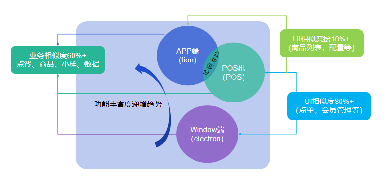
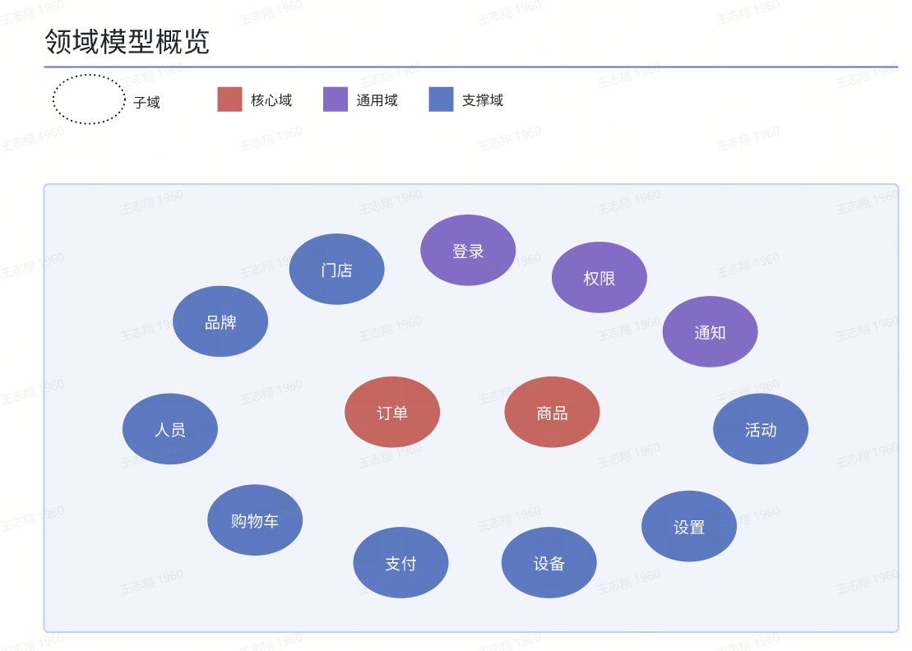
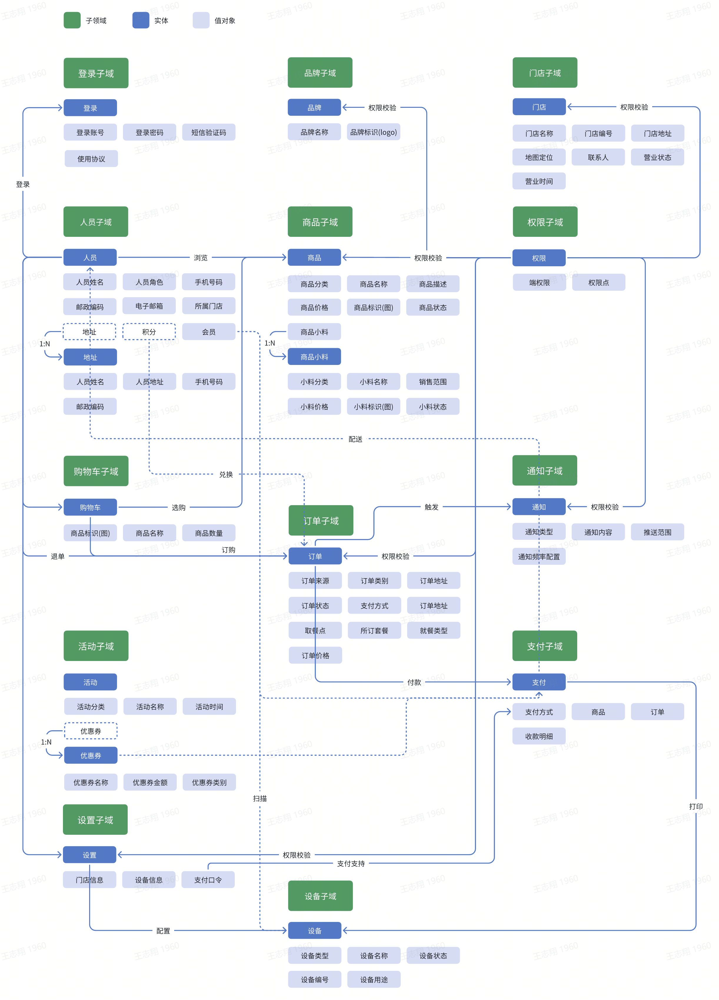
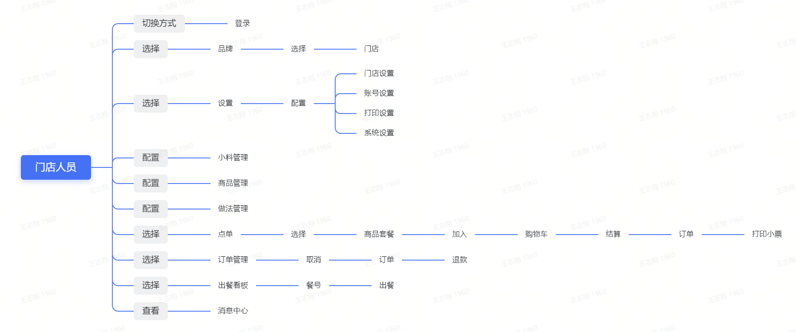
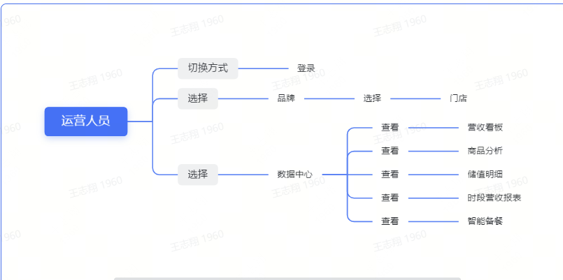

# DDD 领域驱动设计

DDD（Domain-Driven Design，领域驱动设计）是一种软件开发方法论，强调将业务领域作为软件设计的关键驱动因素。DDD 将关注点放在业务领域的核心概念和业务规则上，通过深入理解领域知识和业务需求，来指导软件设计的过程。

以下是 DDD 的一些核心概念和基本原则：

1. 领域：领域是指业务系统中的特定领域，包括业务规则、业务过程、实体、价值对象等。DDD 鼓励开发人员与领域专家密切合作，共同建模和理解业务领域。

2. 模型驱动设计：DDD 强调通过领域模型来驱动软件设计。领域模型是对业务领域的抽象和映射，它描述了领域中的实体、关系、行为等。模型应该能够准确地表达领域概念，并且与实际业务需求保持一致。

3. 聚合根：聚合是 DDD 中的一个重要概念，它将一组相关的对象（实体、值对象等）聚合在一起，并以聚合根为入口进行访问和操作。聚合根负责维护聚合内部的一致性和业务规则的执行。

4. 领域事件：领域事件是 DDD 中的另一个关键概念，它表示领域中发生的重要事务或状态变化。通过引入领域事件，可以实现领域间的解耦和松散耦合，提高系统的可扩展性和灵活性。

5. 截获领域逻辑：DDD 鼓励将业务逻辑尽量迁移到领域模型中，并避免将过多的业务逻辑放在应用层或基础设施层。通过截获领域逻辑，可以更好地保护业务规则的完整性和一致性。

DDD 是一种以领域为核心的设计方法，旨在提供更好的软件设计和开发实践，以满足复杂业务系统的需求。它强调与领域专家密切合作、建立共同的语言和模型，以实现软件系统与业务领域的紧密对接。

## 门店架构及业务升级

一、业务功能相似度分析
门店多端涉及 APP 端、POS 端及 window 端，业务相似度较高，UI 相似度差异化明显（POS 和 window 端相近），面临各端独立性开发

二、技术栈与框架分析

.PNG>)

三、封装方式的发展与差异

.PNG>)

四、业务融合的实施方式

方式一：RN 面向适配跨 APP 端结构，UI 层适配，目前无法适应应用功能，涉及蓝牙、打印、通知以及第三方库的兼容性

方式二：数据复杂交互模块使用集成方式接入

方式三：多端业务逻辑存在重叠，进行抽象及抽离进行复用

.PNG>)

五、抽象设计与复用关系

.PNG>)

六、业务融合技术架构

.PNG>)

七、业务融合实施原则

1. 低耦合度：架构结构层耦合度降到最低

2. 抽象设计：公共组件隔离，部分业务组件抽象层次向上提升，增加适配复用场景

3. 规范实施：通过解耦，各层级的范围归属明确，遵循定义规范落地

4. 分步迭代：按业务模块或功能划分，POS 优先迭代，逐步替换

## 门店领域模型

一、门店领域模型聚合

二、门店领域模型划分

三、门店领域模型用例

门店人员

运营人员

