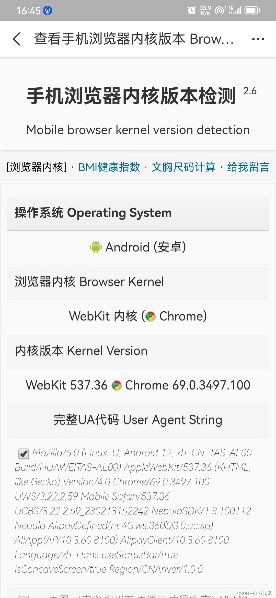

# 问题描述

使用`pixijs`库开发`h5`小游戏，嵌入到`Taro`的`webView`中，在`Android`支付宝小程序打开白屏，但在微信小程序、IOS 支付宝小程序打开正常。

# 问题解决

1. 先排查代码逻辑是否出问题，经过排查发现问题不在代码逻辑
2. 检查是否是`Android`支付宝浏览器内核的问题

- 看看`Android`支付宝`APP`使用的内核是什么
  进入该网页 浏览器内核版本检测， 支付宝扫码网站下面的二维码查看浏览器内核版本;

  

  从图中可以看出`Android`支付宝的浏览器内核版本是`Chrome 69.0.3497.100`。
  我们下载对应版本的浏览器，然后在浏览器中打开 H5 页面，发现了报错：

  ```js
    Uncaught SyntaxError: Unexpected token '?'
  ```

  原来是因为 H5 页面引入的`pixijs`库中使用了`ES2020`的写法“??”导致的报错，那接下来要解决的问题就是如何在打包构建的时候将`ES6`写法转成`ES5`。

- 在`vite 4.x`中打包构建如何将`ES6`转成`ES5`。

  我们选择引入`@vitejs/plugin-legacy`插件来解决该问题。

  ::: tip
  `@vitejs/plugin-legacy`是一个`Vite`插件，旨在提供对旧版浏览器的支持。它通过使用`Babel`和一些其他工具来转换你的代码，使得你的应用程序可以在旧版浏览器上运行，同时还支持现代浏览器。该插件的主要功能是将`ES6+`语法和新 API 转换为`ES5`，以便旧版浏览器可以正确解析和执行。它还支持自动检测当前浏览器的版本，并根据需要加载`polyfills`以填补缺失的功能。使用`@vitejs/plugin-legacy`，你可以轻松地将你的 Vite 应用程序转换为可在大多数浏览器中运行的版本，无需手动编写或配置`Babel`和相关工具。
  :::

  首先安装 `@vitejs/plugin-legacy`;

  ```js
  yarn add @vitejs/plugin-legacy -D
  ```

  在`vite.config.ts`中使用 `@vitejs/plugin-legacy`;

  ```js
  import legacy from '@vitejs/plugin-legacy'
  export default defineConfig({
    plugins: [
      legacy({
        targets: ['defaults', 'not IE 11'],
        modernPolyfills: true,
        renderLegacyChunks: true
      })
    ]
  })
  ```
